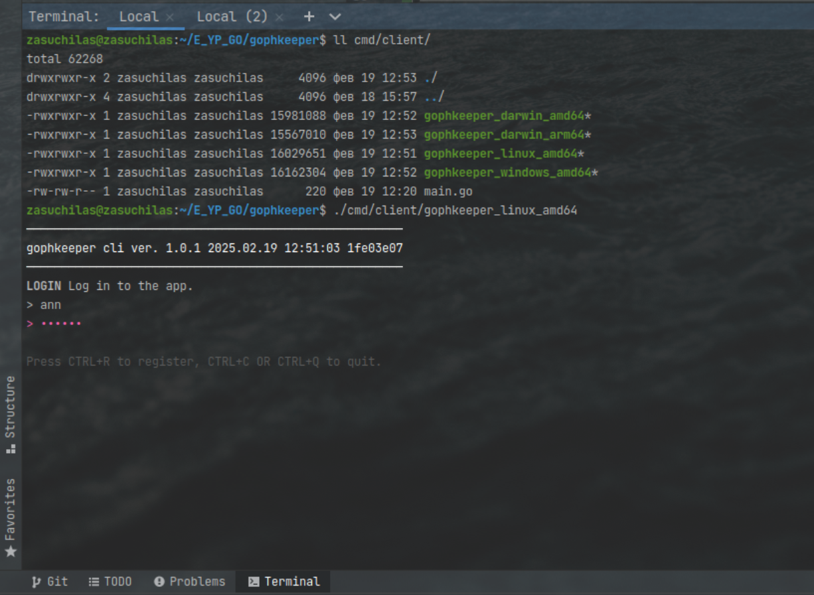
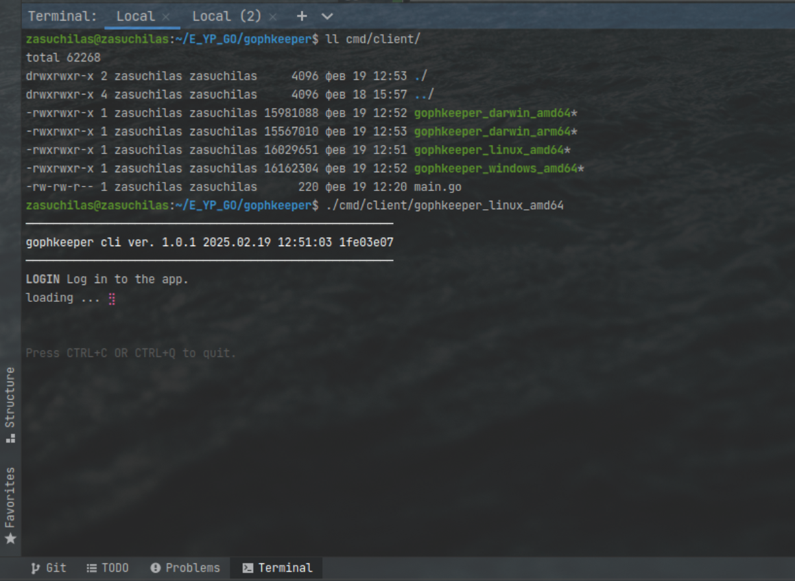
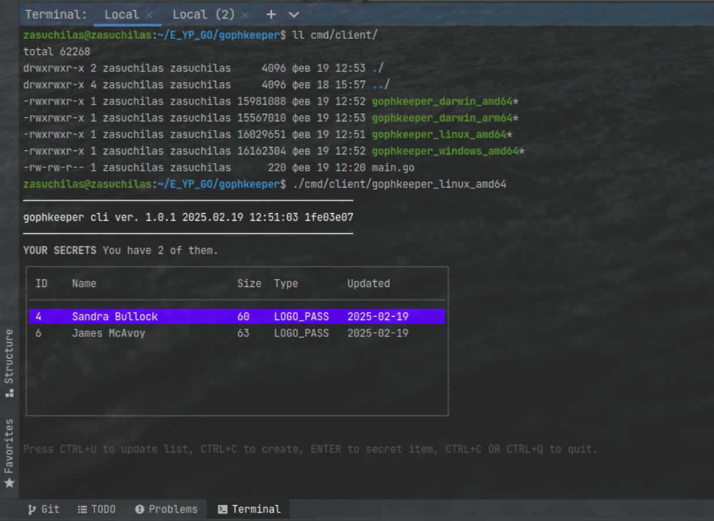
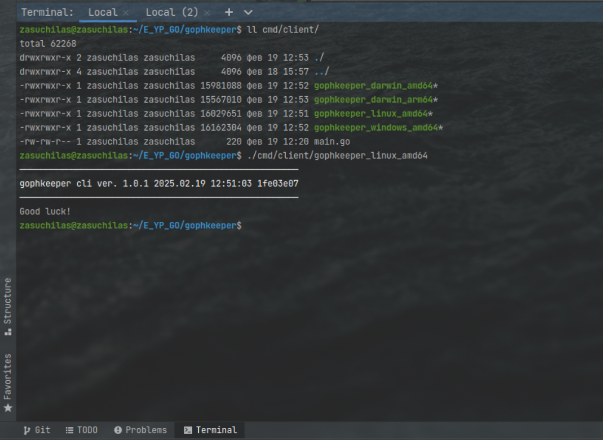

# GOPHKEEPER
Менеджер паролей GophKeeper (выпускной проект).

В ТЗ описаны общие требования к требуемой клиент-серверной системе.
Первым делом я определил контекст: решил какую именно систему из множества возможных создаю.

GophKeeper - менеджер паролей для внутреннего корпоративного использования.
В каждом бизнесе есть сотрудники и пароли, их нужно как-то хранить.
Реализовать требуется первую итерацию: есть сервер для хранения данных и консольный клиент
для пользователей (авторизоваться, получить список своих паролей, добавить, обновить, удалить пароль).

## База данных

- Postgresql
- Всего 2 таблицы (для mvp):
  - **users** для хранения пользователей и парольных хешей
  - **secrets** для секретов
- Секреты по ТЗ могут быть разных видов. Хранить в базе секреты решено в бинарном виде.
  - Поле data типа bytea позволит хранить любые данные.
  - Т.е. клиент присылает байты, сервер хранит то что прислали.
  - Есть поле для хранения мета-информации. Значит, можно добавлять новые типы секретов и типы шифрования без изменения БД.

## Серверная часть

- Используем GRPC
  - Описываем api в одном месте и генерирем серверный и клиентский код для слоя api.
  - Впоследствии можно добавить grpc-gateway и реализовать поддержку работы по http.
- Интерцептор аутентификации и авторизации
  - во-первых, нужно открытьметоды входа и регистрации и закрыть все остальные методы
  - во-вторых, каждый секрет кому-то принадлежит, поэтому нужно иметь userID
  - Решено использовать jwt-токен, который кладется в metadata grpc-запроса.
  - Интерцептор берет jwt-токен из метеданных, валидирует его и получает userID, кладет его в контекст для использования впоследствии.
- Слои сервиса
  - Уровень api для получения запроса и отправки ответа (при поддержке генерированного grpc-кода). Конвертирует данные в/из моделей следующего уровня.
  - Уровень бизнес логики (получает данные с уровня api), обрабатывает их, использует при необходимости методы уровня хранения данных.
  - Уровень хранения данных делает запросы к базе данных по требованию слоя бизнес логики.
  - Слои позволяют упростить код и сделать тестирование на каждом из уровней по отдельности.
  - Уровни связываются посредством интерфейсов в строго заданном направлении.

## Клиентская часть

В ТЗ в дополнительных требованиях написано про cli-приложение
с возможностью запуска на разных платформах, и можно но не обязательно сделать tui.
Я решил сделать tui на фреймворке [Bubble Tea](https://github.com/charmbracelet/bubbletea).

- Клиент тонкий, ничего не хранит вовне.
  - jwt токен хранится только runtime
  - Пользователь начинает с ввода логина и пароля и может свободно работать после этого, пока не закроет приложение.
- Первая реализация содержит 4 экрана: логин/регистрация, список секретов, просмотр секрета, создание секрета.

## Итоги

  
  
  
  

В результате получилось красиво, как задумано, с заложенным ростом проекта в перспективе.

Минусы: не в полном объеме охвачено ТЗ (особенно в части тестировани).

## Backlog

- [ ] Клиент. Доделать клиентскую часть
  - [ ] Экран создания просмотра секрета (доделать)
  - [ ] Экран создания нового секрета
  - [ ] Команда удаления секрета на экране просмотре
- [ ] Сервер. Добавить тесты
  - [ ] на слой бизнес-логики с использованием Mockery
  - [ ] на слой хранения данных с использованием github.com/ory/dockertest/v3
  - [ ] на слой api
- [ ] Клиент. Реализовать остальные 3 типа секретов
- [ ] TOTP
- [ ] Роли (owner, admin, user)
- [ ] Валидация
- [ ] Ротация токенов
- [ ] Локальное хранение на клиенте
...

